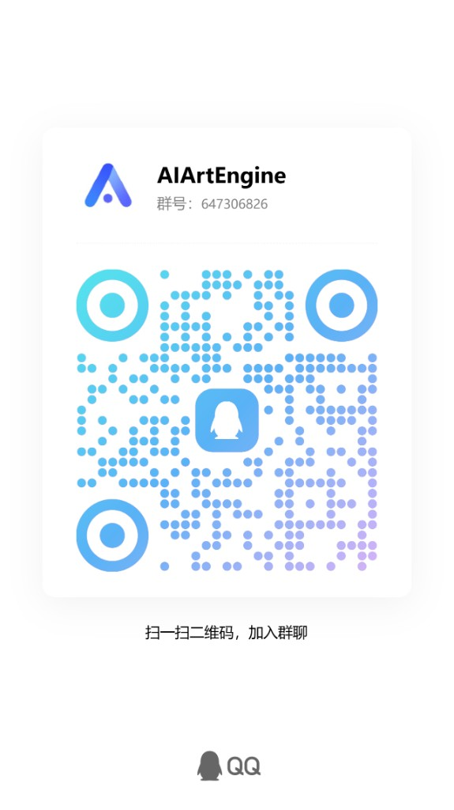
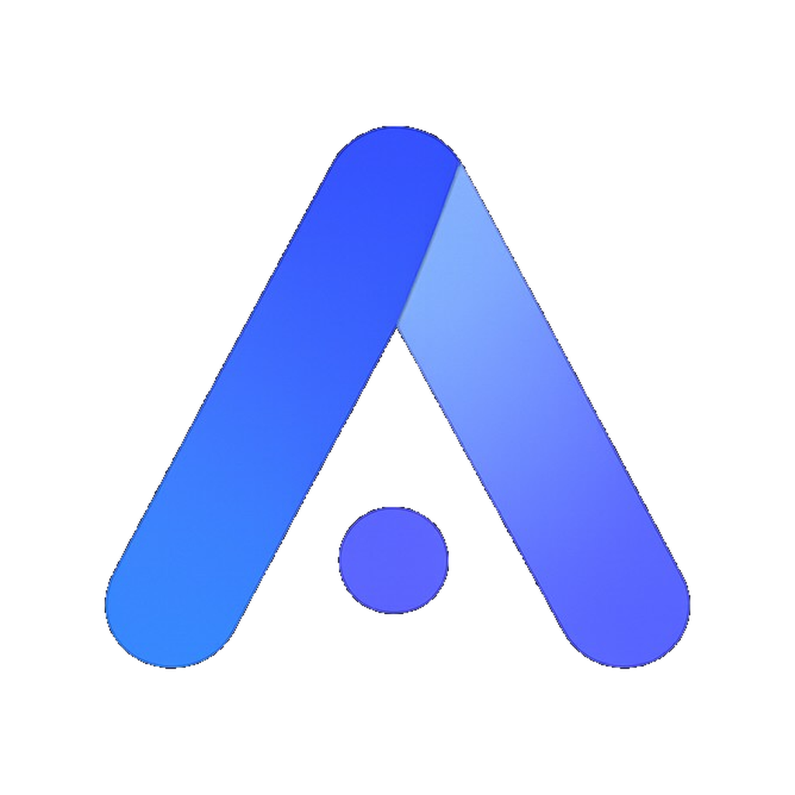

<div align="center">
  

  <h1>AIArtEngine</h1>

  <p><b>Local AI short-video creation studio</b></p>
  <p>
    Projects stay on disk · Shot & node-graph workflows<br />
    OpenRouter & Volcengine Ark (Seedream · Seedance · Audio)
  </p>

  <p>
    <a href="https://github.com/Justin-sky/ai-art-engine/stargazers"></a>
    <a href="https://github.com/Justin-sky/ai-art-engine/network/members"></a>
    <a href="https://github.com/Justin-sky/ai-art-engine/releases"></a>
    <a href="https://github.com/Justin-sky/ai-art-engine/blob/main/LICENSE"></a>
    <a href="https://github.com/Justin-sky/ai-art-engine/blob/main/package.json"></a>
  </p>

  <p>
    
    
    
  </p>

  <p>
    <a href="https://justin-sky.github.io/ai-art-engine/"><b>Website</b></a> ·
    <a href="https://github.com/Justin-sky/ai-art-engine/releases"><b>Download</b></a> ·
    <a href="#community"><b>Community</b></a> ·
    <a href="#features"><b>Features</b></a> ·
    <a href="#quick-start"><b>Quick Start</b></a> ·
    <a href="./README.md"><b>中文</b></a>
  </p>
</div>

---

## Website

Landing page sources live in `website/`:

| Channel | URL |
|---------|-----|
| **GitHub Pages** | https://justin-sky.github.io/ai-art-engine/ |
| **Tencent CloudBase** (CN) | https://ai-art-engine-d9g4us7uqeeabec58-1302031604.tcloudbaseapp.com |

Do not use paths with `/website/` (e.g. `.../website/index.html`) — they 404.

```bash
npm run site          # local preview
npm run site:deploy   # deploy website/ to CloudBase (first time: tcb login)
```

---

<a id="download"></a>

## Download

| Platform | Package | Get it |
|----------|---------|--------|
| **Windows** | `.exe` | [GitHub Releases](https://github.com/Justin-sky/ai-art-engine/releases) |
| **macOS** | `.dmg` | [GitHub Releases](https://github.com/Justin-sky/ai-art-engine/releases) (Mac / CI build; allow in Privacy & Security if unsigned) |
| **Linux** | `.AppImage` | [GitHub Releases](https://github.com/Justin-sky/ai-art-engine/releases) (`chmod +x` then run) |

Push a `v*` tag to trigger GitHub Actions multi-platform builds, or package locally:

```bash
npm run dist:win | dist:mac | dist:linux
```

---

<a id="features"></a>

## Features

**AIArtEngine** is a local-first desktop studio for AI short video: assets, shots, and a node graph in one workbench — your API keys, your files.

- **Local projects** — create / open / recent; JSON + media on disk  
- **Assets** — image / video / audio; AssetRef GUIDs; `.aipackage`  
- **Shots & canvas** — params, Fabric composition, dockable layout  
- **Node graph** — text / image / video / audio generation  
- **Providers** — OpenRouter, Volcengine Ark  
- **Extensible** — Editor Kernel + declarative extensions  

---

<a id="quick-start"></a>

## Quick Start

**Installers**

1. Grab a build from [Releases](https://github.com/Justin-sky/ai-art-engine/releases)  
2. Install → create a project  
3. Add API keys in Settings → create in shots / node graph  

**From source**

```bash
git clone https://github.com/Justin-sky/ai-art-engine.git
cd ai-art-engine
npm install
npm run dev
```

Requires **Node.js 22+**.

```bash
npm run typecheck && npm test
```

---

## Versioning & updates

- SemVer lives in [`package.json`](./package.json); see [`CHANGELOG.md`](./CHANGELOG.md).
- **Release**: bump `package.json` + CHANGELOG, commit, then tag and push:

```bash
git tag v1.0.0
git push origin v1.0.0
```

  CI verifies the tag (without `v`) matches `package.json`, then builds and publishes a [GitHub Release](https://github.com/Justin-sky/ai-art-engine/releases) (including `latest.yml` for auto-update).
- **In-app updates**: packaged builds check Releases on startup; use **Settings → General → About & updates** to check manually, then restart to install. Dev mode (`npm run dev`) skips update checks.

---

## Contribute

Issues and PRs welcome. Please run `npm run typecheck && npm test` before opening a PR.  
Track bugs on [GitHub Issues](https://github.com/Justin-sky/ai-art-engine/issues).

---

## Community

- **Website**: [justin-sky.github.io/ai-art-engine](https://justin-sky.github.io/ai-art-engine/)
- **QQ group**: 647306826 (scan to join)

  

- **Email**: [284139554@qq.com](mailto:284139554@qq.com)

---

## License

[GPL-3.0](./LICENSE)

---

<div align="center">
  <p>If this helps you, please give it a ⭐ Star</p>
  
</div>
