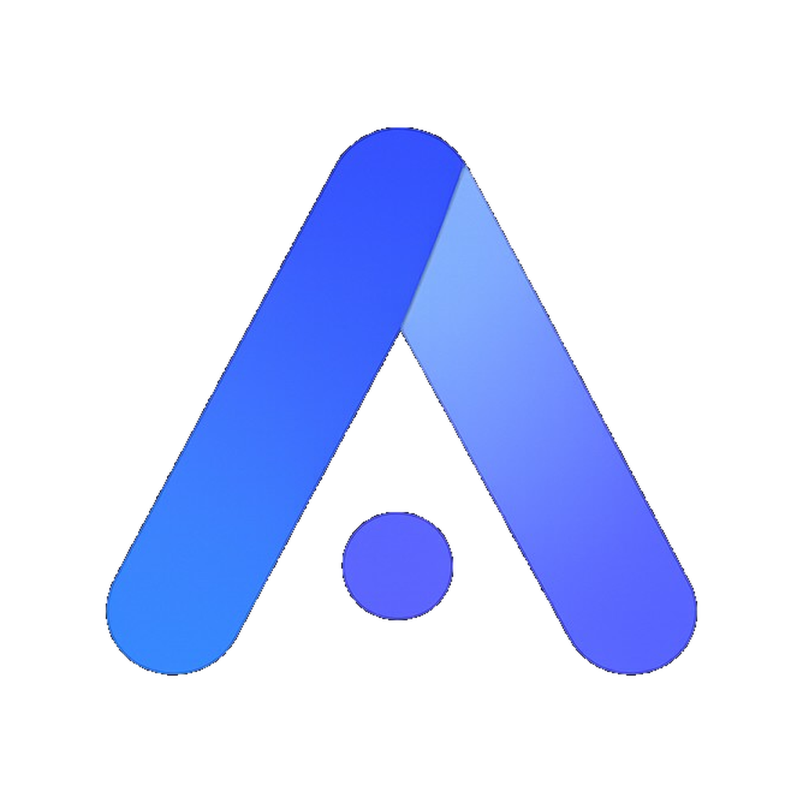

**QQ groups: `346340389` · `647306826`** · <a href="https://x.com/IoKKFOvWAt12669"></a> · If this helps, please ⭐ [Star](https://github.com/Justin-sky/ai-art-engine)

<div align="center">
  

  <h1>AI Art Engine</h1>

  <p><b>Professional AI creation tool · short drama · ads · film</b></p>
  <p>
    Local-first projects · Shot & node-graph workflows · Built-in MCP Server drivable by Claude Code and other AI agents<br />
    OpenRouter · OpenAI · DeepSeek · Zhipu · Kimi · xAI · Google · vLLM · Ollama · LM Studio · Volcengine Ark · Kling · MiniMax · Tongyi Qianwen · ModelScope · ComfyUI · Meshy · Tripo · Rodin (Hyper3D) · Luma AI · Lux3D · Custom provider (OpenAI-compatible / Anthropic / Gemini endpoints)<br />
    Object storage: Volcengine TOS · Alibaba Cloud OSS · Tencent Cloud COS
  </p>

  <p>
    <a href="https://github.com/Justin-sky/ai-art-engine/stargazers"></a>
    <a href="https://github.com/Justin-sky/ai-art-engine/network/members"></a>
    <a href="https://x.com/IoKKFOvWAt12669"></a>
    <a href="https://github.com/Justin-sky/ai-art-engine/releases"></a>
    <a href="https://github.com/Justin-sky/ai-art-engine/blob/main/LICENSE"></a>
    <a href="https://github.com/Justin-sky/ai-art-engine/blob/main/package.json"></a>
  </p>

  <p>
    
    
    
  </p>

  <p>
    <a href="https://justin-sky.github.io/ai-art-engine/index.en.html"><b>Website</b></a> ·
    <a href="https://justin-sky.github.io/ai-art-engine/manual.en.html"><b>Manual</b></a> ·
    <a href="https://justin-sky.github.io/ai-art-engine/guide-video.en.html"><b>Video guide</b></a> ·
    <a href="https://justin-sky.github.io/ai-art-engine/guide-short-video.en.html"><b>Short-video guide</b></a> ·
    <a href="https://justin-sky.github.io/ai-art-engine/guide-comfyui.en.html"><b>ComfyUI guide</b></a> · <a href="https://justin-sky.github.io/ai-art-engine/guide-mcp.en.html"><b>MCP Setup</b></a> ·
    <a href="https://space.bilibili.com/3707036976024122"><b>Video tutorials</b></a> ·
    <a href="https://github.com/Justin-sky/ai-art-engine/releases"><b>Download</b></a> ·
    <a href="#community"><b>Community</b></a> ·
    <a href="#features"><b>Features</b></a> ·
    <a href="#quick-start"><b>Quick Start</b></a> ·
    <a href="./README.md"><b>中文</b></a>
  </p>
</div>

---

<a id="download"></a>

## Download

| Platform    | Package     | Get it                                                                                                                            |
| ----------- | ----------- | --------------------------------------------------------------------------------------------------------------------------------- |
| **Windows** | `.exe`      | [GitHub Releases](https://github.com/Justin-sky/ai-art-engine/releases)                                                           |
| **macOS**   | `.dmg`      | [GitHub Releases](https://github.com/Justin-sky/ai-art-engine/releases) (Mac / CI build; allow in Privacy & Security if unsigned) |
| **Linux**   | `.AppImage` | [GitHub Releases](https://github.com/Justin-sky/ai-art-engine/releases) (`chmod +x` then run)                                     |

Push a `v*` tag to trigger GitHub Actions multi-platform builds, or package locally:

```bash
npm run dist:win | dist:mac | dist:linux
```

---

<a id="features"></a>

## Features

**AIArtEngine** is a professional AI creation tool for short drama, ads, and film: assets, shots, and a node graph in one desktop app — local-first projects, your API keys, your files.

### Headline features: AI chat + MCP

> Drive every generation and orchestration capability from an in-app conversation — or let external AI agents such as Claude Code / Codex connect straight to your project.

- **AI chat panel** — in-app AI assistant (DeepSeek Harness runtime): `@`-reference project assets in conversation and let the agent call MCP tools directly — generate image / video / 3D / speech, edit node graphs, run workflows and track status; multi-session history; model picker over any configured text provider
- **MCP tool server** — built-in MCP Server so external agents like Claude Code / Codex can drive your project over stdio bridge or direct HTTP (plan & commit workflows, run generation, read/write assets and graphs); stable token across restarts, audit log, concurrency gate

### Headline feature: Plugin marketplace (workflows · skills · MCP in one place)

> **Marketplace**, immediately left of Settings in the top bar, opens a separate window that installs community workflows, bundled skills and MCP servers onto this machine — ready to use from AI chat.

- **Separate window, singleton** — the **Marketplace** button sits immediately to the left of Settings and is an **app-level entry** (no project required); clicking it again only focuses the window that is already open. Tabs: **All / MCP / Skills / Workflows**
- **Workflow catalog** — every time the window opens it **force-refreshes** the remote catalog, so a newly published workflow shows up without waiting for a cache TTL. When the primary source (GitHub raw) is unreachable it falls back automatically to a Gitee mirror and says so at the top of the window (“Primary source unreachable — switched to the mirror”); offline it shows the last cached catalog. Cards carry **Install / Update / Reinstall / Uninstall / Details**, and uninstalling goes through the app's own confirmation dialog (locally installed files are removed)
- **Entries that include a skill** — a workflow may **ship a skill bundle** (a skill is the agent's playbook for a task): the card shows “Includes skill”, or “Includes skill + scripts” when the bundle carries scripts. **Scripts are code the AI agent can run on this machine**: installing asks first and **lists every script path** for you to confirm; cancelling installs the instructions and references only (no scripts on disk, and the **workflow still works**). That consent is asked every time and never remembered. Uninstalling a workflow also removes the skill bundle it installed — bundles are listed in the marketplace's **Skills** tab with their source marked as a **skill bundle**, and they are not managed on their own
- **Using it in AI chat** — the **Workflows** button in the composer toolbar, or `/workflow`, opens the installed list; selecting one inserts a **reference block** (icon + title), hovering reveals the full reference including the id, and on send the agent reproduces that exact workflow by id (`workflow_use_installed`) instead of re-planning something similar
- **MCP tab** — inspect the built-in `aiartengine` MCP tool server and the Blender toolset, or add your own third-party MCP servers (remote HTTP or local stdio command) with a connection test before saving
- **A second gate for going past the sandbox** — when the agent needs to go beyond the sandbox, a “This step needs your approval” card appears in the conversation with the tool name and reason, offering only **Allow once / Reject**. There is deliberately no “always allow”, and paths with nobody to answer **fail closed** (rejected, never silently allowed)

### Headline feature: Blender MCP Server (let AI drive Blender directly)

> With Blender running on the same machine, your AI can build scenes, write materials, screenshot for self-check, and export GLB — **straight from the conversation**. Outbound to the addon, no uv / Python / subprocess.

- **Drive Blender directly** — 9 MCP tools cover the inspect → model → screenshot → export loop: `get_scene_info` / `get_world_state_snapshot` / `get_object_info` for scene & selection state; `execute_blender_code` to run Python with full bpy / bmesh / mathutils access inside Blender; `get_viewport_screenshot` to grab the viewport and return it to multimodal clients; `export_scene` for GLB / GLTF / FBX / OBJ / USD / STL (chain with `asset_import` to land in the asset library); plus `describe_node_type` / `bpy_api_lookup` / `get_addon_status` to inspect node sockets, look up bpy APIs, and check addon versions.
- **Both addon variants** — community [blender-mcp](https://github.com/ahujasid/blender-mcp) `addon.py` and the official [Blender Lab "MCP Server"](https://projects.blender.org/lab/blender_mcp) extension are both supported; pick in **Settings → MCP → Blender tools**. Tool names, schemas and outputs are **identical** across backends — the model side doesn't care which is running.
- **Zero extra dependencies** — no uv, no Python subprocess, no Blender config changes: the app makes an outbound socket connection to the addon's `localhost:9876`. Works out of the box from installer, repo, or container.
- **Chat panel and external agents share the same tools** — the in-app ◈ AI chat panel ("use Blender to make a base from these cubes, then screenshot it") and Claude Code / Codex external agents use the **same** Blender toolset. Toggle off in Settings to drop the whole group from the tool list — the main toolset is unaffected; the panel's Ask / Plan modes constrain Blender tools the same way, so it can't become a side door around panel mode.
- **Mode backstop & screenshot boundary** — `execute_blender_code` **no longer applies a lexical code guard** (full Python / bpy is allowed); writes are still narrowed by Ask / Plan at request level. Screenshots go through a one-shot temp file and are returned to multimodal clients only — they never touch the project or the audit log.

Full tool reference, protocol details, and safety design: [MCP guide](./docs/MCP.md) / [MCP setup tutorial](https://justin-sky.github.io/ai-art-engine/guide-mcp.en.html#blender).

### Full capabilities

- **Local projects** — create / open / recent; JSON + media on disk
- **One-click workflow** — presets (short-drama storyboard, game UI, game UA, product ad, e-commerce, game 3D assets, comic publishing, knowledge voice-over, 3D blockout…) or AI-planned topology → reusable host asset (boundary I/O + Dive)
- **Plugin marketplace** — a separate window from the top bar: install and uninstall workflows / skill bundles / MCP servers in one place, with script paths listed one by one for consent; installed workflows are reproduced by id from the AI chat's “Workflows” entry (self-hosted catalog sources are supported in the data layer — the `workflowMarket.source` setting takes several addresses and uses only those when set — but there is no input for it in the settings UI yet)
- **Assets** — image / video / audio / 3D model; AssetRef GUIDs; `.aipackage`; **multi-select file / folder drag to another directory** (disk move + descendant asset.relativePath rewrite + cycle detection + duplicate-name auto-append ` 2` / ` 3`)
- **Shots & canvas** — params, Fabric composition, dockable layout
- **Node graph** — text / image / video / audio / music / sound effect / 3D model / spatial world / decisions generation nodes with instruction panel & model params; generation lock, dual gallery outputs; ports must match (singular cannot connect to plural; select nodes accept list ports only); edge styles / minimap; task queue reuses shared upstream, fault-tolerant run mode (failed nodes degrade without aborting the chain); comic page (panel grid + speech bubbles, transparent-PNG export), ad variant matrix, 2D frame animation & frame-anim sheet generation, layer separation (export PSD)
- **Audio nodes (voice group)** — **Voice** (`asset.voice`, TTS dubbing; the text in the instruction box is what gets read aloud, so it shows no system prompt), **multi-speaker dialogue** (`asset.dialogue`, one `speaker: line` per line, the whole exchange synthesized in one call, voices bound per speaker in the Inspector, and a missing voice is reported naming the segment and speaker), **sound effect** (`asset.sfx`, dedicated `/v1/sound-generation` endpoint, describing the sound itself rather than a line, with seamless looping + expected duration 0.5–30 s + prompt influence 0–1, landing in `Cache/Sfx`), **music** (`asset.music`, composition / BGM with an instrumental toggle and lyrics, landing in `Cache/Music`) and **select voice** (`voice.select`, pick one of several upstream voices).
- **Music and voice are two separate modalities** — each has its own tab in Settings and each node dropdown reads only its own: music covers OpenRouter (Google Lyria 3), ElevenLabs (`music_v2_5` and friends), MiniMax (`music-3.0` / `music-2.6`) and DashScope (`fun-music-v1` / preview). The two tabs never bleed into each other (the music dropdown never lists TTS models), and settings that stored music models under the Audio tab are migrated automatically.
- **World models (world group)** — **spatial world generation** (`asset.spatialWorld`: text / 1–4 reference images / one reference video → a walkable 3D world, four World Labs Marble tiers, with panorama detection, verbatim mode and a seed; local references upload to World Labs hosted storage by default, so **no object storage is required**; output includes a GLB mesh plus a `*.spz` Gaussian splat and a 360° panorama), **spatial world export** (`spatialWorld.export`, **mandatory** before feeding a world into the Director Stage or 3D processing because `spatialWorld` ports are strictly typed and do not implicitly accept `model`; **mesh mode (default)** produces an HQ GLB registered as a model asset, either textured or vertex-coloured, while **splat mode** writes a PLY next to the world output without registering an asset. The upstream is asynchronous, takes up to about an hour, is rate-limited to 4 calls per hour and is billed separately) and **world element extraction / world element table / world element generation** (pull the characters, scenes, props and weapons out of a world and render them one by one).
- **Portrait retouch (node)** — PixCake-style retouching node `image.portrait` (image refine group): double-click the node card for a dive editor with 14 tool groups along the top rail (heal / skin / tone / face reshaping / eyes / makeup / body / light / colour / texture / region / background / ID photo / export). Intensities are five-step segmented buttons (`off / light / standard / strong / max`); makeup looks, LUTs, background handling and ID-photo specs are named options. The editor shows a live prompt preview (the exact text sent to the model, copyable), before/after comparison (hold, or split with a draggable divider), wheel zoom, view rotation with Shift+wheel or `[` `]`, Space / middle-drag panning (double-click empty space to reset) and undo/redo. **There is exactly one execution path: parameters → prompt → the image model you pick** (no local pixel filters); ID photos are then cropped to spec and tiled to a 5-inch sheet. Wiring several images into one node retouches them in one batch with the same settings (up to 24), face landmarks are cached per source-image fingerprint, and tool groups with an unmet dependency are greyed out with an explanation in the tooltip and parameter panel (7 need face landmarks, Background needs the segmentation model, Body needs the pose model). **"Affect only the matching area" is on by default**: after the model renders the whole frame, the result is feathered back through the face (with neck) / person / manual-region-box mask so everything else keeps the exact original pixels. Background swaps, ID photos and colour grading are whole-frame by nature and stay whole-frame; if landmarks or the segmentation model are missing, that part falls back to the whole frame with a line in the run log. The inspector carries the shared output preview (thumbnails / full screen / save to library / pick a version), and the in-editor AI enhance actions (smart erase / new background / makeup boost / upscale) call the image model directly and store their results as rollback-able node versions. Reopening the panel defaults to the node's current output
- **Host assets** — boundary ports outside, full graph inside via Dive
- **Director stage** — 3D pose shots & action recording (`Cache/Videos`); square ports `out-shots` / `out-actions`; 3D model input port auto-instantiates on dive; panorama input auto-set as background; AI scene blockout, 20+ primitives, material texture override (base / normal maps), shading & wireframe modes; viewport controls are **LMB select · MMB pan · RMB look / first-person fly (WASD)**, and **five sensitivities (look, fly, orbit, pan, zoom) are adjustable in the floating panel on the viewport's bottom toolbar** — applied as you drag, and the defaults match the previously hard-coded feel
- **Timeline** — import/group clips, scrub tracks; picture-in-picture overlay (position / size / opacity / volume) & video-track transitions; preview selection vs full-timeline play; export
- **Model providers** — OpenRouter (text / image / video / decisions / speech / music), OpenAI (GPT text / gpt-image), DeepSeek (text), Zhipu (GLM text / CogView image), Kimi / Moonshot (text), xAI / Grok (text / image / video), Google / Gemini (text / image / video), ElevenLabs (speech / multi-speaker dialogue / sound effects / music), local vLLM (text / Wan video), Ollama / LM Studio (text, OpenAI-compatible, no API key), Volcengine Ark (Seedream / Seedance / voice), Kling, MiniMax (incl. music), Tongyi Qianwen / DashScope (incl. music), ModelScope, ComfyUI (API v2: image / video / audio, local or cloud Base URL), MagicRouter (OpenAI-compatible aggregator: text / image / video), World Labs Marble (spatial world generation), Meshy / Tripo / Rodin (Hyper3D) / Luma AI / Lux3D (3D model generation, text-to-3D / image-to-3D), custom provider (pick an endpoint type: OpenAI-compatible / Anthropic / Gemini, enter Base URL and API key, fetch text models)
- **3D rigging & skeleton** — generation nodes output geometry only (no inline “Generate rig” since 6.4.1); rigging happens in the **3D Rigging** graph node through the cloud Rigging API: **Meshy** `POST /openapi/v1/rigging`, **Tripo** `POST /v3/animations/rig` (optional Mixamo / Tripo bone naming and GLB / FBX output). **Luma AI / Lux3D cannot rig**, so they never appear in that node's provider list.
- **3D mesh processing (nodes)** — eight processing nodes in total (rigging included): **rig check** (free; `riggable` + recommended rig type), **animation retarget** (Tripo `preset:walk` presets / Meshy action-library `action_id`, with the library loadable in the panel), **mesh split** (mesh / smart segmentation, listing the resulting part names), **part completion**, **retopology** (Tripo smart / basic tiers, Meshy remesh), **texture** (incl. Meshy retexture) and **format convert** (GLTF / FBX / USDZ / OBJ / STL / 3MF with FBX presets, pivot-to-bottom, UV packing, quads and per-part export). A per-provider capability matrix drives the UI: **Tripo covers 8 ops, Meshy 5**, provider dropdowns only list vendors implementing that action, and the Inspector hides parameters the selected vendor does not understand. **Part completion only accepts a segmentation task id and retarget only a rig task id**; foreign task ids automatically fall back to uploading the model for a public URL.
- **Web-search providers (Settings panel)** — DeepSeek Search (default) / Tavily / Brave / SerpAPI / Mock adapters running side-by-side; each can be independently enabled, with its own Base URL, API key, search depth and time window; the panel has a built-in connectivity test. Deliberately split from the model provider system — fewer adapters, no context injection needed.
- **Common network-error diagnosis across all 33 providers** — axios network errors (`err.code` + `err.cause.code` / `err.cause.message`) lifted out of the Kling adapter into a shared `readHttpError` helper. DNS / TCP / pre-TLS-handshake socket resets now surface stable UI tags like `ECONNRESET` / `UND_ERR_SOCKET`, so you can tell at a glance whether the firewall killed the handshake or the server just refused the connection.
- **Object storage** — Volcengine TOS, Alibaba Cloud OSS, Tencent Cloud COS (only one enabled at a time; for public reference media URLs)
- **Extensible** — Editor Kernel + Cordis internal plugins (windows / Inspector / nodes / skills / executors) + declarative external plugin list

### Providers at a glance

| Kind           | Provider            | Capabilities                                                                                                                                                  |
| -------------- | ------------------- | ------------------------------------------------------------------------------------------------------------------------------------------------------------- |
| Model          | OpenRouter          | Text / image / video / decisions / speech / **music** (aggregated catalog; decisions via the Decisions API, music is Google Lyria 3 over `/audio/speech`)     |
| Model          | OpenAI              | Text / image (requires network access to api.openai.com)                                                                                                      |
| Model          | DeepSeek            | Text (deepseek-chat / deepseek-reasoner)                                                                                                                      |
| Model          | Zhipu               | GLM text / CogView text-to-image                                                                                                                              |
| Model          | Kimi (Moonshot)     | Text (kimi-k2 family / moonshot-v1 family)                                                                                                                    |
| Model          | xAI (Grok)          | Text / Grok Imagine image / Grok Imagine Video (async polling)                                                                                                |
| Model          | Google (Gemini)     | Text / Nano Banana image / Veo 3.1 video (async polling, official OpenAI-compatible layer)                                                                    |
| Model          | ElevenLabs          | Speech (incl. multi-speaker dialogue) / **sound effects** (`/v1/sound-generation`) / **music** (`/v1/music`, `music_v2_5` and friends); uses the official SDK |
| Model          | vLLM                | Local text / video (Wan T2V / I2V, OpenAI-compatible, no API key)                                                                                             |
| Model          | Ollama / LM Studio  | Local text (OpenAI-compatible, no API key)                                                                                                                    |
| Model          | Volcengine Ark      | Text / Seedream / Seedance / voice design                                                                                                                     |
| Model          | Kling               | Image / video (API Key)                                                                                                                                       |
| Model          | MiniMax             | Text / image / video / voice design / **music** (`music-3.0` / `music-2.6`)                                                                                   |
| Model          | Tongyi Qianwen      | Text (compatible mode) / Wanxiang image & video (incl. HappyHorse) / **music** (`fun-music-v1` / preview)                                                     |
| Model          | ModelScope          | Text / text-to-image (access token)                                                                                                                           |
| Model          | ComfyUI             | Image / video / audio (API v2; local :8189 or cloud Base URL)                                                                                                 |
| Model          | MagicRouter         | Text / image / video (OpenAI-compatible aggregator, async video polling)                                                                                      |
| Model          | World Labs (Marble) | **Spatial world generation** (text / image / multi-image / video to world, four model tiers; output includes a GLB mesh plus a Gaussian splat)                |
| Model          | Meshy               | Text-to-3D / image-to-3D (incl. multi-image, API key)                                                                                                         |
| Model          | Tripo               | Text-to-3D / image-to-3D (API key)                                                                                                                            |
| Model          | Rodin (Hyper3D)     | Text-to-3D / image-to-3D (API key)                                                                                                                            |
| Model          | Luma AI             | Text-to-3D / image-to-3D (API key)                                                                                                                            |
| Model          | Lux3D               | Text-to-3D / image-to-3D (incl. multi-image, G1 / G1-Turbo, API key)                                                                                          |
| Model          | Custom              | Text (pick endpoint type: OpenAI-compatible / Anthropic / Gemini, enter Base URL and API key)                                                                 |
| Object storage | TOS / OSS / COS     | Upload + signed URLs; mutually exclusive enable                                                                                                               |

Configure under **Settings → Models** / **Settings → Object storage**. Local ComfyUI needs [comfy-api-proxy](https://justin-sky.github.io/ai-art-engine/guide-comfyui.en.html) on port 8189 — do not point Base URL at 8188.

---

<a id="quick-start"></a>

## Quick Start

**Installers**

1. Grab a build from [Releases](https://github.com/Justin-sky/ai-art-engine/releases)
2. Install → create a project
3. Add model providers (and optional object storage) in Settings
4. Use toolbar **One-click workflow**, or build chains in shots / node graph
5. Open the **◈ AI chat** panel in the left rail, `@`-reference assets and let the assistant generate; or follow the [MCP guide](https://justin-sky.github.io/ai-art-engine/guide-mcp.en.html) to connect Claude Code and other external agents

Full guide: [Manual](https://justin-sky.github.io/ai-art-engine/manual.en.html) (source: `website/manual.en.html`). Local ComfyUI needs [comfy-api-proxy](https://justin-sky.github.io/ai-art-engine/guide-comfyui.en.html) on port 8189 — do not point Base URL at 8188.

**From source**

```bash
git clone https://github.com/Justin-sky/ai-art-engine.git
cd ai-art-engine
npm install
npm run dev
```

Building from source requires **Node.js 22+** (the app bundles its own Node runtime — end users don't need to install Node).

```bash
npm run typecheck && npm test
```

---

## Docs

- [Manual](https://justin-sky.github.io/ai-art-engine/manual.en.html) (`website/manual.en.html`)
- [Architecture](./docs/ARCHITECTURE.md) · [Graph plugins](./docs/GRAPH_PLUGINS.md) · [Docs index](./docs/README.md)
- [Asset model](./docs/ASSET_MODEL.md) · [AssetRef](./docs/ASSET_REF.md) · [Asset package](./docs/ASSET_PACKAGE.md)
- [Roadmap](./docs/ROADMAP.md) · [Changelog](./CHANGELOG.md)

---

## Versioning & updates

- SemVer lives in [`package.json`](./package.json); see [`CHANGELOG.md`](./CHANGELOG.md).
- **Release**: bump `package.json` + CHANGELOG, commit, then tag and push:

```bash
git tag v5.0.0
git push origin v5.0.0
```

CI verifies the tag (without `v`) matches `package.json`, then builds and publishes a [GitHub Release](https://github.com/Justin-sky/ai-art-engine/releases) (including `latest.yml` for auto-update).

- **In-app updates**: packaged builds check Releases on startup; use **Settings → General → About & updates** to check manually, then restart to install. Dev mode (`npm run dev`) skips update checks.

---

## Contribute

Issues and PRs welcome. Please run `npm run typecheck && npm test` before opening a PR.  
Track bugs on [GitHub Issues](https://github.com/Justin-sky/ai-art-engine/issues).

---

## Community

- **Website**: [justin-sky.github.io/ai-art-engine](https://justin-sky.github.io/ai-art-engine/index.en.html)
- **Video tutorials**: [Bilibili space](https://space.bilibili.com/3707036976024122)
- **QQ groups**: `346340389` · `647306826`
- **X**: <a href="https://x.com/IoKKFOvWAt12669"></a>
- **Email**: [284139554@qq.com](mailto:284139554@qq.com)

---

## License

[GPL-3.0](./LICENSE)
