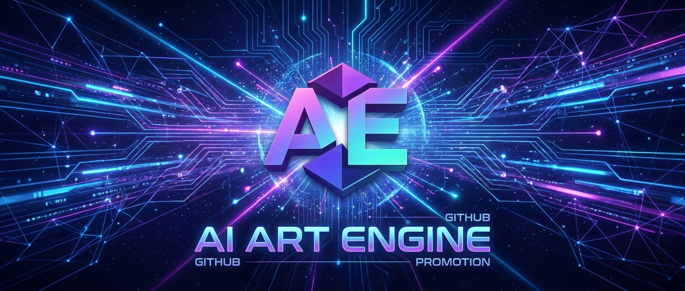
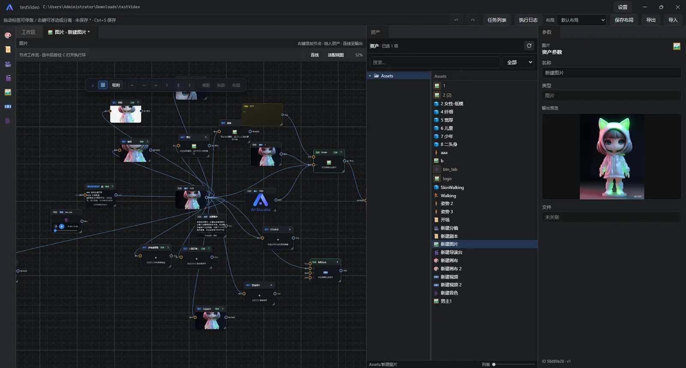

<div align="center">

<a href="https://justin-sky.github.io/ai-art-engine/index.en.html">
  
</a>

<p><b>The agent-native AI art asset engine</b><br />Generate, organize and reuse images, video, voice, 3D models and explorable worlds in one desktop app</p>

<p>
  <a href="https://github.com/Justin-sky/ai-art-engine/releases"></a>
  <a href="https://github.com/Justin-sky/ai-art-engine/releases"></a>
  <a href="https://github.com/Justin-sky/ai-art-engine/stargazers"></a>
  <a href="./LICENSE"></a>
  
</p>

<p>
  <a href="https://justin-sky.github.io/ai-art-engine/index.en.html">Website</a> ·
  <a href="https://justin-sky.github.io/ai-art-engine/quickstart.en.html">Quickstart</a> ·
  <a href="https://justin-sky.github.io/ai-art-engine/manual.en.html">Manual</a> ·
  <a href="https://github.com/Justin-sky/ai-art-engine/releases">Download</a> ·
  <a href="./CHANGELOG.md">Changelog</a> ·
  <a href="./README.md">中文</a>
</p>



</div>

## Overview

AI Art Engine is an open-source desktop app that puts model calls, node-graph orchestration, 3D previsualization and final editing into one local project, for short drama, ads, games and e-commerce content.

- **Agent-native**: the in-app AI chat calls tools to generate and orchestrate directly; a built-in MCP server lets Claude Code, Codex and other external agents work on your project too.
- **Node graph and One-Click Workflow**: text, image, video, audio, 3D and spatial-world modalities; industry templates become reusable host assets in one click.
- **3D director stage and timeline**: blocking, camera angles and motion recording, then arrange and export on the final timeline.
- **Many models, local-first**: 30+ model providers with your own API keys; a project is a folder of JSON and media files on your machine, with no relay service in between.

## Getting started

Download an installer from [Releases](https://github.com/Justin-sky/ai-art-engine/releases): Windows `.exe`, macOS `.dmg` (`x64` for Intel, `arm64` for Apple Silicon) or Linux `.AppImage`.

1. Open **Settings → Models**, add a provider and enter its API key.
2. Create a project and pick One-Click Workflow under New in the workspace to generate your first assets.
3. Open the AI chat (◈ on the left), `@`-reference assets and let the assistant keep going.

See the [Quickstart](https://justin-sky.github.io/ai-art-engine/quickstart.en.html) for the full walkthrough.

## Connect an external agent

While running, the app serves a token-protected MCP tool service on `127.0.0.1`:

```bash
# stdio bridge (requires Node.js 18+)
claude mcp add aiartengine -- node <install-dir>/resources/mcp-bridge.mjs

# or connect over HTTP (endpoint and token are under Settings → MCP)
claude mcp add --transport http aiartengine <endpoint> --header "Authorization: Bearer <token>"
```

Tool reference and security design: [`docs/MCP.md`](./docs/MCP.md).

## Build from source

Requires Node.js 22+.

```bash
git clone https://github.com/Justin-sky/ai-art-engine.git
cd ai-art-engine
npm install
npm run dev
```

Built with Electron, Vue 3, TypeScript, Pinia, Three.js and Cordis; see [`docs/ARCHITECTURE.md`](./docs/ARCHITECTURE.md). Testing, packaging, releases and common environment issues are covered in [`CONTRIBUTING.md`](./CONTRIBUTING.md).

## Documentation

|                   |                                                                                                                                                                                                                    |
| ----------------- | ------------------------------------------------------------------------------------------------------------------------------------------------------------------------------------------------------------------ |
| Users             | [Quickstart](https://justin-sky.github.io/ai-art-engine/quickstart.en.html) · [Manual](https://justin-sky.github.io/ai-art-engine/manual.en.html) · [Video tutorials](https://space.bilibili.com/3707036976024122) |
| Plugin publishers | [Developer docs](https://justin-sky.github.io/ai-art-engine/developers.en.html) · [`docs/MARKETPLACE.md`](./docs/MARKETPLACE.md)                                                                                   |
| Contributors      | [`docs/`](./docs/README.md) · [Roadmap](./docs/ROADMAP.md) · [Changelog](./CHANGELOG.md)                                                                                                                           |

## Contributing

Issues and pull requests are welcome; please read [`CONTRIBUTING.md`](./CONTRIBUTING.md) first. GitHub is the primary repository and [Gitee](https://gitee.com/beijing_blue_whale_era_zhangjian/ai-art-engine) is a mirror; their `main` branches stay in sync.

<a href="https://github.com/Justin-sky/ai-art-engine/graphs/contributors">
  
</a>

## Community

QQ groups `346340389` · `647306826` ｜ [Bilibili](https://space.bilibili.com/3707036976024122) ｜ [X @IoKKFOvWAt12669](https://x.com/IoKKFOvWAt12669) ｜ [284139554@qq.com](mailto:284139554@qq.com)

## License

[GPL-3.0](./LICENSE)
